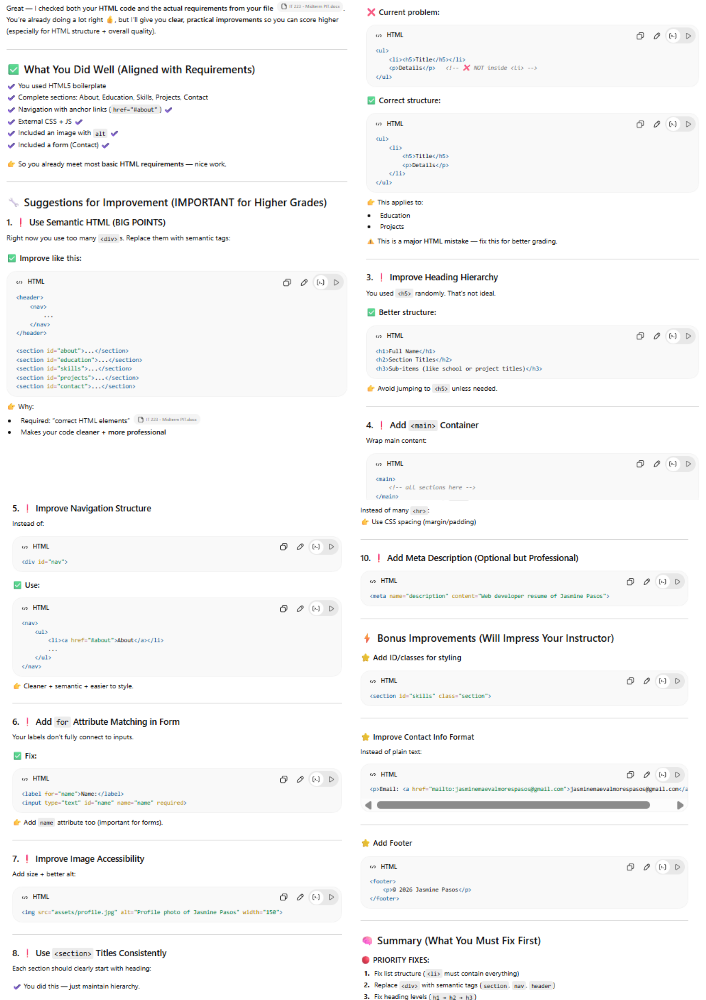
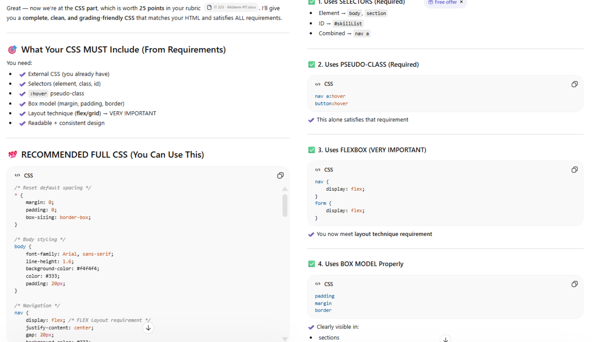
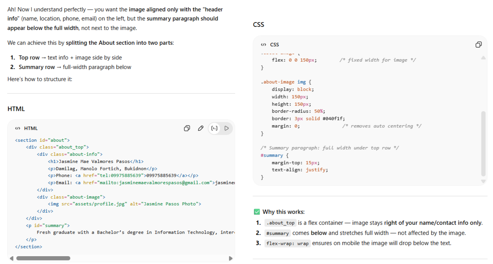
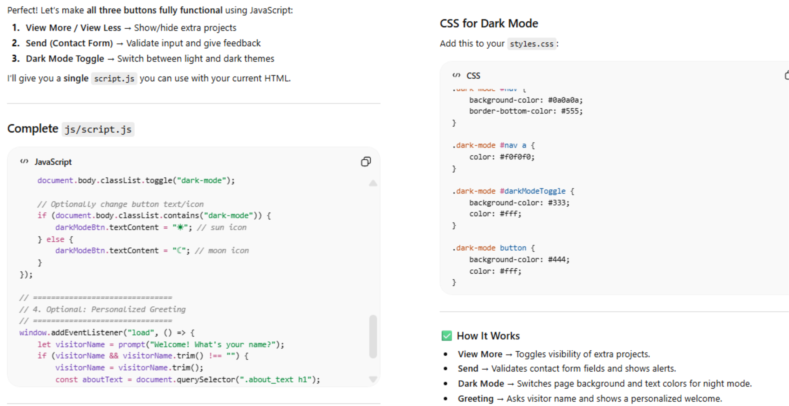
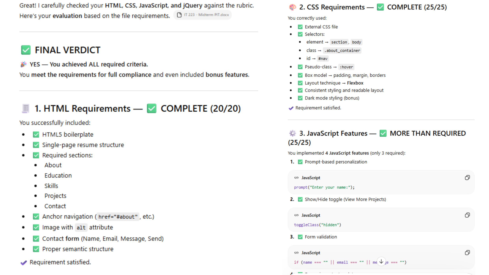

# Appendix B: AI Prompt Log

Name: Jasmine Mae Valmores Pasos  
Section: IT2R6  

Video Link: https://youtu.be/PRCgP8J6K2A  
GitHub Pages Link: (add your link here)

---

## Entry #1
Tool Used: ChatGPT

Prompt (copy-paste exactly):
Based on the instructions and requirements from the file for HTML, please check my html code and what are your suggestions for improvement.

AI Output (screenshot):

How I used/modified it in my project:
- I wrapped my navigation bar inside a header and nav element.  
- I used <section> instead of 
 for better semantic structure.  
- I fixed the list structure in the education section.  
- I added a footer section.  

---

## Entry #2
Tool Used: ChatGPT

Prompt (copy-paste exactly):
Now, what's your suggested CSS for my html, based on the instructions and requirements from the file. Here is my drafted CSS code: [CODE]

AI Output (screenshot):

How I used/modified it in my project:
- I improved my margins and paddings.  
- I adjusted the navbar alignment (used space-around for better spacing).  
- I refined the image size and styling.  
- I added smooth scrolling for navigation links.  
- I added a dark-mode class.  

---

## Entry #3
Tool Used: ChatGPT

Prompt (copy-paste exactly):
How can I move the picture to the right side of the about section, aligned with my name, email, and contact?

AI Output (screenshot):

How I used/modified it in my project:
- I created a container inside the about section and applied flexbox in CSS.  
- I aligned the image to the right side while keeping my personal information on the left.  

---

## Entry #4
Tool Used: ChatGPT

Prompt (copy-paste exactly):
How can I make the buttons like view more, send, and dark mode functional?

AI Output (screenshot):

How I used/modified it in my project:
- I implemented functionality for my buttons including dark mode toggle, send button validation, and view more interaction.  
- I added a resume download button and a personalization greeting feature using JavaScript.  

---

## Entry #5
Tool Used: ChatGPT

Prompt (copy-paste exactly):
BASED ON THE INSTRUCTIONS, REQUIREMENTS, AND CRITERIA FROM THIS FILE, I WILL SHOW YOU MY CODES AND PLEASE TELL ME IF I ACHIEVED ALL OR I MISSED SOMETHING

AI Output (screenshot):

How I used/modified it in my project:
- I used the feedback to finalize my project.  
- I ensured all required features were complete and working properly.